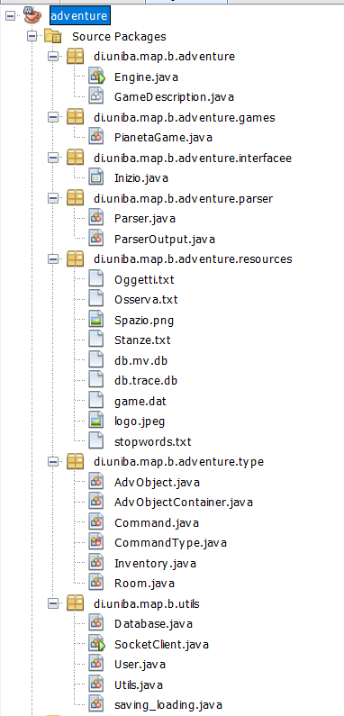
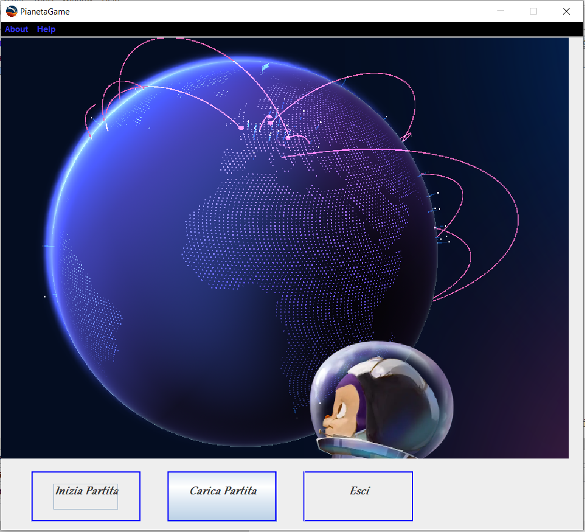
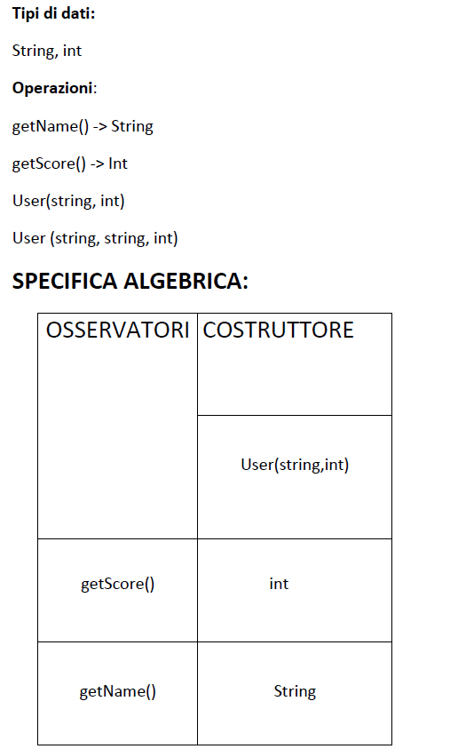
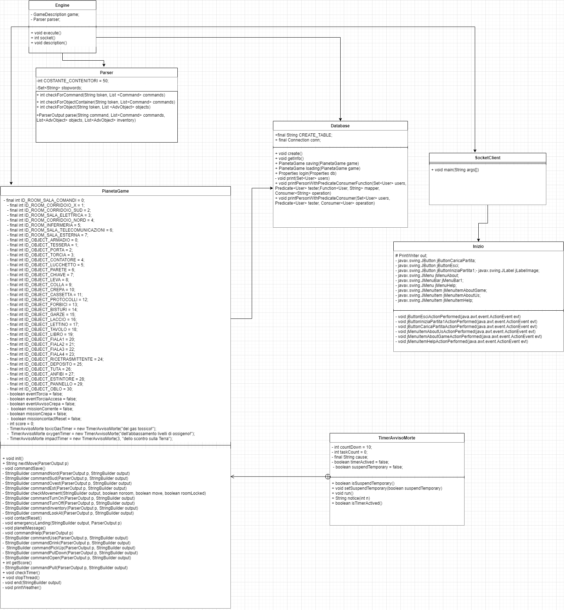

 

# **RELAZIONE PROGETTO "Pianeta Game"**

**GRUPPO**: Le Bimbe di Luca
 

**AUTORI**: Serio Luca, Nasca Raffaella, Nardiello Rosalba
  

# Indice

### 1. [Introduzione](#1)
1. [Idea del gioco](#1.1)  
### 2. [Architettura del sistema](#2)
### 3. [Dettagli implementativi e tecnologie utilizzate](#3)
1. [Dettagli implementativi](#3.1) 
1.1 [File](#3.1.1) 
1.2 [DataBase](#3.1.2) 
1.3 [Thread](#3.1.3) 
1.4 [Socket](#3.1.4) 
1.5 [Swing](#3.1.5) 
1.6 [Lambda expressions](#3.1.6) 
1.7 [Rest Full](#3.1.7) 
2. [Teconologie utilizzate](#3.1) 
### 4. [Specifica algebrica di una struttura dati utilizzata](#4)
### 5. [Soluzione del gioco](#5)
### 6. [Diagramma delle classi](#6)
  

# 1. Introduzione
Questo documento rappresenta la relazione tecnica finale che implementa un gioco testuale del gruppo Le Bimbe di Luca.

## 1.1. Idea del gioco
L'idea del nostro gioco si basa su di un Capitano che ha perso i controlli della sua navicella.
 Per riuscire a ristabilirli e non precipitare deve affrontare varie missioni che una volta superate gli permetteranno di riacquisire i comandi della navicella e ritornare sulla sua rotta fino alla sua destinazione iniziale.
 
  

# 2. Architettura del sistema
La nostra avventura testuale è stata sviluppata in un'ottica di estendibilità sotto più fronti.
In primo luogo, come previsto nel paradigma Object Oriented, vengono sfruttati meccanismi di ereditarietà tra classi per lasciare spazio ad eventuali future estensioni, prevenendo inoltre la ripetizione di codice. 
 Inoltre per avviare il gioco bisognerà avviare prima la classe Engine e subito dopo la classe SocketClient
Le classi che sono state implementate e divise nei vari PacKages sono le seguenti: 

 

# 3. Dettagli implementativi e tecnologie utilizzate
## 3.1. Dettagli implementativi

In questa sezione verranno elencati tutti gli argomenti del corso Metodi Avanzati di Programmazione che sono stati inseriti nel progetto con anche le motivazioni annesse all'utilizzo di essi.

### 3.1.1. File
Nel progetto i FIle vengono utilizzati per tener traccia di varie cose che l'utente incontrerà lungo la strada. 
Sono stati creati due file nominati Oggetti.txt e Stanze.txt che contengono rispettivamente la descrizione di Oggetti e Stanze che faranno parte del gioco.
Inoltre ci sono altri due file con utilità diversa: il primo Stopwords.txt è stato creato per far si che vengano inserite in esso tutte le parole che il Parser non deve tener conto per la comprensione di comandi più dettagliati, il secondo Osserva.txt invece  è utilizzato per immagazzinare descrizioni più dettagliate delle stanze se l'utente digita il comando "osserva".

### 3.1.2. DataBase
Un DB contiene e gestisce dati, importanti per varie operazioni supportate da applicazioni software; per questo motivo esso è stato utilizzato per il salvataggio delle partite già incominciate che possono essere riprese in seguito sempre dallo stesso giocatore.

### 3.1.3. Thread
Thread: sono unità di esecuzione meno complesse dei processi, un processo può essere composto da più thread e quest'ultimi all’interno dello stesso processo condividono
le stesse risorse.
IN questo caso essi sono stati usati per scandire il tempo mancante per svolegere delle missioni; le missioni che sfruttano questa carartteristica dei thread sono tre: 
- il ritrovamento di una fiala per sopravvivere ad un gas tossico entrato nella navicella
- il riavvio dei sistemi d'ossigeno per mancanza di quest'ultimo
- la decisione di effettuare un atterraggio d'emergenzaa sul proprio pianeta  
Nel caso il timer scandito dal thread dovesse giungere alla fine il giocatore ha perso la partita.

### 3.1.4. Socket
 In Java si usa un socket per creare la connessione ad un’altra macchina. Il socket è una astrazione software usata per rappresentare i terminali di una connessione tra due macchine. E' stata implementata una classe basata su stream:
- SocketServer che il server usa per ascoltare una richiesta di connessione 
- SocketClient usata dal client per inizializzare la connessione 

### 3.1.5. Swing
E’ il framework di JAVA che permette la realizzazione di interfacce grafiche, infatti all'apertura dell'avventura testuale si aprirà un'interfaccia che darà tre ozioni che l'utente potrà cliccare: 
- inizia una nuova partita
- carica una partita già iniziata
- esci   
Inoltre oltre ai comandi sopra descritti, verrà visualizzata come sfondo un'immagine inerente al gioco e il logo sempre di esso.    
Ecco come appare la schermata iniziale grafica: 

 

### 3.1.6. Lambda Expression
Per il nostro proggetto le Lambda Expressions sono state usate per la visualizzazione dei punteggi dei giocatori che hanno salvato le loro credenziali.
 
 ### 3.1.7. Rest Full
Sono state utilizzate le Rest Full per implementare il meteo della città di Bari, aggiornato in tempo reale, all'interno del gioco nel momento in cui il giocatore si affaccia verso l'oblo della navicella.

## 3.2. Tecnologie utilizzate
All'interno del nostro progetto è stata utilazzata la tabella hash per far si che vengono memorizzati gli alias, quindi i sinonimi di determinati comandi che possono essere usati con più frequenza all'interno del gioco,come ad esempio i comandi "osserva" o "usa" hanno a disposizione vari sinonimi che l'utente può scegliere di utilizzare. Tutti questi sinonimi vengono immagazinati all'interno delle tabelle hash.

# 4. Specifica algebrica di una struttura dati utilizzata
Il gruppo ha deciso di mostrare come specifica algebrica la classe User: 

# 5. Soluzione del gioco

MAPPA RELATIVA AL GIOCO : 

- indovinello 1 -> SALA COMANDI: per poter sbloccare tutte le porte bisogna strisciare la carta che è persente nell'armadio all'interno della sala comandi con la porta principale che porta verso l'uscita.

- indovinello 2 -> INFERMIERIA: per poter sopravvivere al gas tossico entrato nella  navicella a causa di uno scontro, bisogna bere la fiala dei Gas Tossici che si trova sul tavolo all'interno della stanza.

- indovinello 3 -> SALA ELETTRICA: per poter riuscire a rimettere in funzione l'intero impianto elettrico della navicella bisognerà trovare la chiave, immersa tra cavi, che sbloccherà il lucchetto dell'impianto elettrico e lo rimetterà in funzione.

- indovinello 4 -> SALA TELECOMUNICAZIONI:per poter ristabilire i contatti persi con il proprio pianeta d'origine bisognerà riaccendere la ricetrasmittente presente all'interno della stanza tramite il completamento di una sequenza di numeri 11 22 .. 30 22 44 dove la soluzione è : 15 .

- indovinello 5 -> SALA ESTERNA/IMPIANTO O2: per poter riattivare l'ossigeno all'interno della navicella bisogna semplicemente indossare prima la tuta per poter sbloccarli esternamente.

- indovinello 6 -> ATTERRAGGIO D'EMERGENZA: per attivare l'atterraggio d'emergenza bisogna rispondere alla seguente domanda: Attraversa il vetro ma senza romperlo. Cosa è? La risposta è LUCE.
 
# 6. Diagramma delle classi
  
 
 
